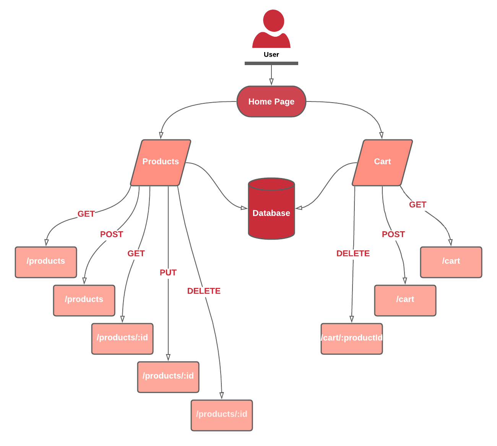

# myStore

---

[LIVE SITE]()

---

## Overview

*A small store web app*

---

## Authors 

*Ruba Banat*

---

## Architecture

*libraries, frameworks and packages*

*Javascript, Nodejs, Express, mySQL, React*

---

## Domain Modeling 

---

## Features & Routes

### <ins>**Product**</ins> (/products)

| Method | Endpoint | Description  |
| :---: | :--- | :--- |
| GET | /products | Get all products |
| POST | /products | Create new product |
| GET | /products/:id | Get product details |
| PUT | /products/:id | Update product |
| DELETE | /products/:id | Delete product |

### <ins>**Cart**</ins> (/cart)

| Method | Endpoint | Description  |
| :---: | :--- | :--- |
| GET | /cart | Get all Products in the cart |
| POST | /cart | Add new  Product to the cart |
| DELETE | /cart/:productId | Delete product from cart |

---

## Install

- Clone the repository from GitHub

- Run the command `npm i` to install dependencies

- create .env file with these variables:

    - DB_HOST=localhost
    - DB_USER=root
    - DB_PASS=****
    - DB_NAME=store

---

# `T` `H` `E` `E` `N` `D` 